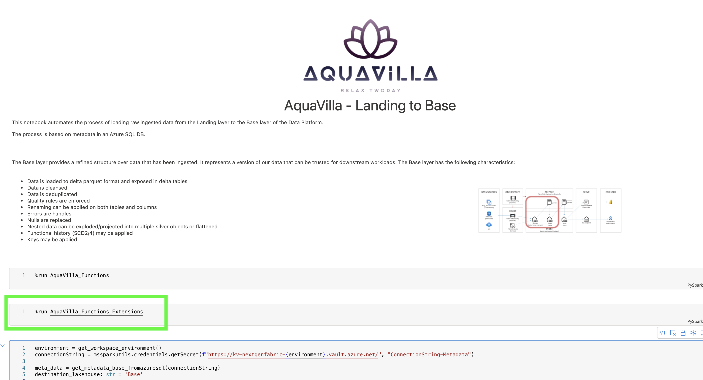

# Extending and customize AquaVilla #

In order to facilitate an easy upgrade of future AquaVilla versions, it is encouraged not to modify the AquaVilla_Functions notebook.

The recommendation is to use an AquaVilla_Functions_Extensions or a like file. There is an example of such in the AquaVilla package. An extension is an ordinary notebook, and there can be more than one if needed. If it is an extension notebook, the recommendation is to include "extension" in the notebook name.

To use an extension notebook, run it from a cell after the AquaVilla_Functions notebook with the %run command. This way, it is possible to add new functionality or override existing functions by using the exact same function signature from AquaVilla_Functions. The is for global variables.

```python
# Gets overridden
def greet(name):
    print(f'Hello {name}')

# Is untouched
def greet():
    print(f'Hello')

# The first function signature is: def greet(name)
# This function signature is also def greet(name), but is declared last.
# Because of this, the last function will override the previously defined one
# and will be called when greet("Brian") is invoked.
def greet(name):
    print(f'Guten tag {name}')

```

