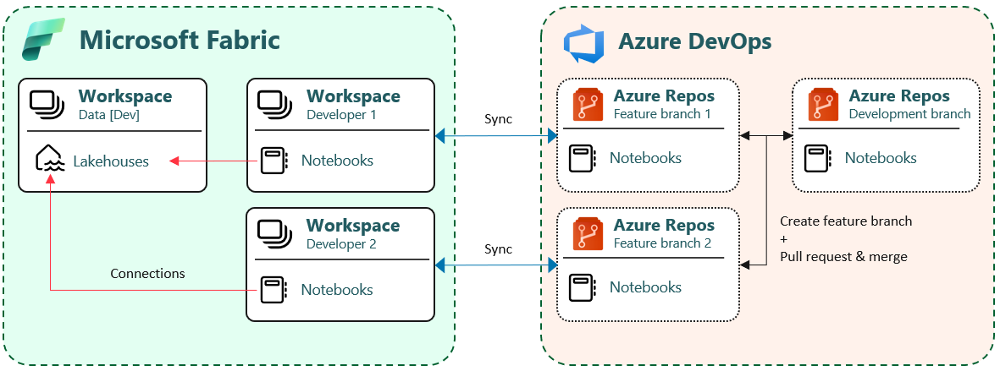
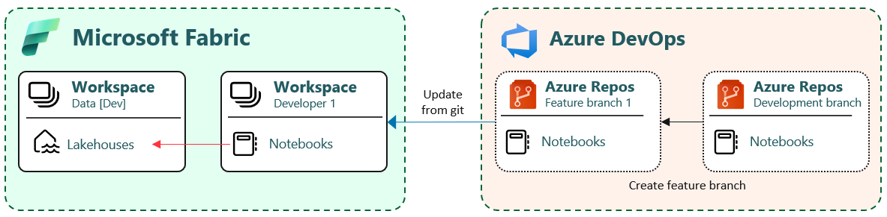
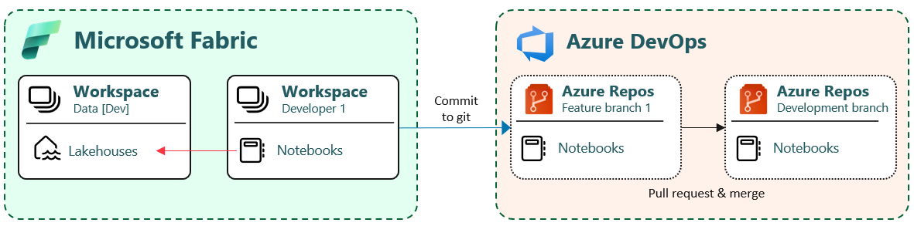

# Setup git integration

This guide is focusing on the Lakehouse architecture. You might need a similar setup for working with semantic models and reports.

## Prerequisites

- Permissions to create workspaces in the tenant
- Use internal Entra users. External guest users causes a lot of trouble

## Developer workspaces

Managing the complexities of multiple developers working on numerous feature branches simultaneously is done by using **Developer workspaces**. Each developer should work in isolation, using a **private workspace** as an isolated development environment.

## Initial configuration

### Step 1
- Create feature branch in Azure DevOps
- Create a developer workspace in Fabric
- [Connect workspace to the feature branch](https://learn.microsoft.com/en-us/fabric/cicd/git-integration/git-get-started). Set git folder to /Fabric
- Wait a couple of minutes and verify that notebooks has been synced to workspace

### Step 2
- Attach notebooks to lakehouses in the Development workspace - see section...
- Commit (sync) changes to git
- Go to Azure DevOps and create a pull request and merge changes to development branch

## Ongoing development

This follows the same process as the initial configuration, where each developer will work with their own feature branch in their own developer workspace. They will commit (sync) small, frequent code changes that are easy to merge and less likely to get into conflicts
