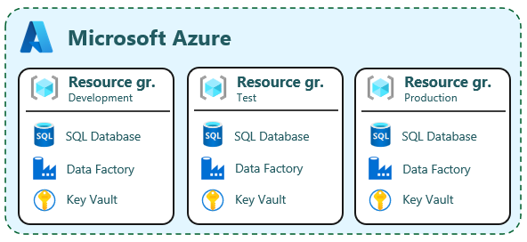
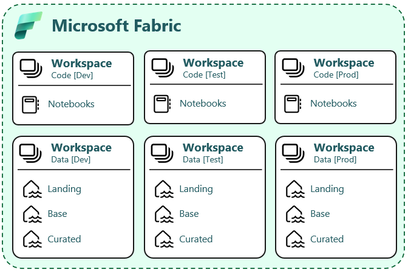

# Setup infrastructure

This article describes the infrastructure that needs to be setup in Azure and Fabric.

## Azure services

In your Azure tenant, you will need to setup a number of components before you can start using AquaVIlla and develop your Lakehouse solution.

 - Azure Sql Server Database
 - Azure Data Factory
 - Azure Key Vault



Depending on the data [ingest approach](../intro/01-ingest.md) you might also need to Deploy a Data Lake (Azure Storage Account with hierarchical namespace enabled).

It's not yet possible to create an Azure Fabric F SKU with an IaC approach. It's recommended to start by using a [Fabric trial capacity](https://www.microsoft.com/en-us/microsoft-fabric/getting-started) in the development phase and manually create one or more Azure Fabric F SKU's when needed. See the [Capacity settings](#capacity) for guidelines.

## Fabric

It's currently not possible to create Fabric items with the IaC publisher, so you need to create workspaces and lakehouses manually.

### Tenant settings

Be sure that the [Users can create Fabric items](https://learn.microsoft.com/en-us/fabric/admin/fabric-switch) tenant switch is enabled.


### Workspaces

You need to create two workspaces for each environment for the Lakehouse architecture. This makes it easier to create a working CD/CD process.



- Code [dev]
- Data [dev]
- Code [test]
- Data [test]
- Code [prod]
- Data [prod]

This is our suggested workspace naming convention: 

   ```
    [Organizational Domain Name - ]<ProjectName>[ <Data Platform] - {[Code] | [Data]} {[dev] | [test] | [prod]}
   ```

Examples:
 - Sales - AquaVilla Data Platform - Code [dev]
 - Finance - AquaVilla - Code [dev]
 - AquaVilla - Data [prod]

Align the convention with the organization in question as they could have a different standard for workspace naming.

It is recommened to separate Semantic Models and Report in another set of workspaces.

#### Workspace access

[Give users access to the workspaces](https://learn.microsoft.com/en-us/fabric/get-started/give-access-workspaces), by using the exsisting security groups that have been created as part of setting up the infrastructure following the IaC process.

- The Entra Group for solution administrators should have the admin role in all the workspaces
- The Entra Group for solution developers should have the member role in all the workspaces

### Lakehouses

In the "data" workspaces, you need to create one lakehouse item per layer in the architecture. This is the three default lakehouse items:

- Landing
- Base
- Curated

## Steps

1. Use the [IaC publisher](../../iac/intro.md) to deploy the services in Azure
2. Enable Fabric in the tenant settings
3. Create Fabric workspaces
4. Create Fabric Lakehouses