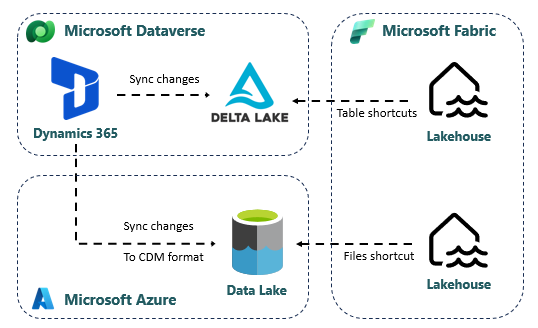

# Ingest

It's recommended to use Azure Data Factory for data ingestions. It's quick to get up and running with the [Data Ingestion Framework Docs](intro.md).

It will be an obvious consideration to move data ingestion into the Fabric platform when it gets more mature and get supports for:
 - On-premises data sources (Gateway)
 - Parametized connections
 - Git integration

All these features are on the releaseplan for Q1 2024.

## Azure Data Factory

The landing zone structure is depicted by the method used for ingestion. If twoday data & ai's best practice module for ingestion is used, the following structure is used:

`/<source>/<object>/<type>/<loadtype>/<year>/<month>/<day>/<object>_<loadtype>_datetime.parquet`

Type is either data, meta or keys.
Loadtype is used to distinguish between full and incremental loads.

### Storage in ADLS

This is the default destination when using the Ingest Framework.

Go to the Landing lakehouse and manually create a [Fabric OneLake shortcut](https://learn.microsoft.com/en-us/fabric/onelake/onelake-shortcuts#adls-shortcuts) in the files section to the container and folder in ADLS.

## Dataverse

Ingestion of data from Dynamics 365 is supported through two dedicated "Link" methods in Dataverse. It makes it easy to directly connect data from Power Apps and Dynamics 365 to Microsoft Fabric.

### Link to Microsoft Fabric

- Creates a “read-replica” of the data in Dataverse Storage in Delta Lake
- Creates a Lakehouse in the Fabric Workspace and creates Shortcuts to the Delta Tables.
- More info: https://learn.microsoft.com/en-us/power-apps/maker/data-platform/azure-synapse-link-view-in-fabric

### Link to Azure Synapse

- Creates a “read-replica” of the data in Azure Data Lake Storage (ADLS)
- Stores the data in a [CDM folder structure](https://learn.microsoft.com/en-us/common-data-model/model-json) (with model.json and csv files)
- More info: https://learn.microsoft.com/en-us/power-apps/maker/data-platform/azure-synapse-link-data-lake
