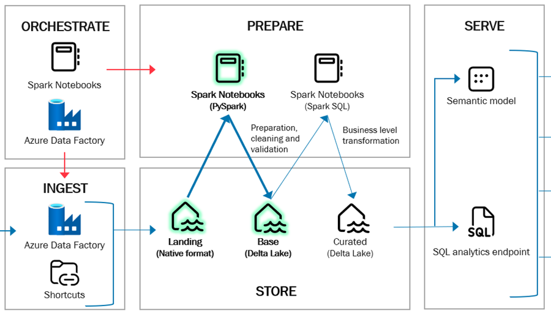

# Landing to Base

The purpose of the moving data from the **Landing** layer into a **Base** layer is to store data in a cleansed, deduplicated and trusted state where functional history such as SCD2 can be applied.

The Base layer is the source for the curated layer which exposes the modelled and aggregated data.

## Notebooks

The process of moving data between the two layers are handled by the **LandingToBase notebook** which reads metadata from a table and iterates through the different rows and processes the tables sequentially. 

LandingToBase notebook is attached to the Base lakehouse item.

## Metadata

The processing of data between Landing and Base is defined using metadata stored in the table `meta.ObjectDefinitionsBase` with different patterns for reading from the Landing layer and writing data to the Base layer.

| **Metadata column**             	| **Colum description**                                                                                                                                        	|
|---------------------------------	|--------------------------------------------------------------------------------------------------------------------------------------------------------------	|
|     ID                          	|     Auto-incremental id. Populated automatically.                                                                                                            	|
|     SourcePath                  	|     Folder or file path to read from in the files section of the Landing layer.                                                                              	|
|     SourceType                  	|     File type of the source file(s). This is parquet for data loaded from relational databases and CSV for uploaded files.                                   	|
|     SourceReadBehavior          	|     The different read patterns are Full and Auto. Auto loading the latest full extract and all following deltas. Full loading only the latest full extract. 	|
|     ReadOptions                 	|     Spark read options as json. Defines different options such as header, separator, multiline etc.                                                          	|
|     DestinationTable            	|     Name of the Delta table in the Base Layer.                                                                                                               	|
|     DestinationWriteBehavior    	|     The different write patterns are overwrite, append, scd1 and scd2.                                                                                       	|
|     Keys                        	|     List of business keys. Keys are used when doing upserts (scd1 and scd2).                                                                                 	|
|     ProjectedColumns            	|     List of columns to move from Landing to Base. All columns are moved if none are specified.                                                               	|
|     ModifyDateColumn            	|     Column to use for sorting when moving multiple incremental loads. Typically this is a modified date column.                                              	|
|     Translations                	|     JSON object specifying column renaming.                                                                                                                  	|
|     PartitionBy                 	|     Columns to partition by. The storing of the Delta Tables are then partitioned into folders such as year, month and day etc.                              	|
|     RecreateFlag                	|     True/false indicating if the table should be dropped before loading to Base.                                                                             	|
|     IncludeFlag                 	|     True/false indicating if the table should be processed between Landing and Base.                                                                         	|

## Table schema

Might another name for this section? The idea is to describe, that schema of tables in the base layer is not part of source control. They are automatically created when moving data from Landing.

And also describe how schema drift is then handled.

## Naming conventions

The framework is designed with a set of general naming conventions. The language should be English except for source table and column names (if originally written in Danish or another language).

To be compliant with the Spark implementation in Databrick it's decided to convert everything to lower [snake case](https://en.wikipedia.org/wiki/Snake_case) (string separated with underscore). Avoid special characters in names and avoid spaces.

### Table names

There is no schema level available on tables in Fabric. The table names should follow a structure with two main parts:

`<sourcesystemname>_<entityname>`

Table examples:

 - adventureworks_lt_address
 - dynamics_crm_product_class
 - salesforce_sales_customer_group

### Column names

Column names should generally follow a structure with with three parts: 

`<category>_<qualifiers>_<class>`

Category:

  - The categorization word that often corresponds to the entity the column is from

Qualifier:

  - Further qualification of the category if necessary.
  - 0-many qualifiers. In most of the cases, qualifiers will not be necessary.

Class:

  - Class words specify in general the content type of the field value

Avoid using abbreviations unless globally agreed upon. Use explicit naming when possible.

Column examples: 

- Attribute column: address_line_1
- Attribute column: purchase_order_requested_quantity
- Attribute column: sales_net_amount_dkk
- Business key: customer_group_key
- Surrogate key: calendar_id

**Reserved words**

  - _id: Used to mark a Primary Key in the curated layer --> rename source columns to "_code"
  - _key: Used to mark a business key in the curated layer--> rename source columns to "_code" if not used for business keys
  - lh_: Used for Lakehouse system columns
  - _utc: Used as an addon on datetime / time columns to denote the timezone.
  - _cet: Used as an addon on datetime / time columns to denote the timezone.

