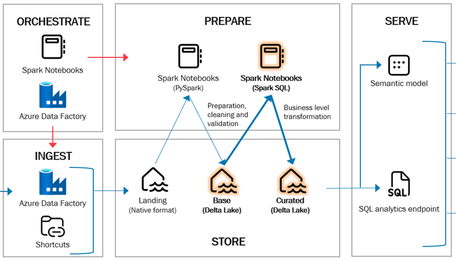

# Base to Curated

The purpose of the Curated layer is to store data in a dimensional model with individual business modelled entities such as dimensions, facts and bridge tables.

## Notebooks

The process involves multiple spark notebooks, one for each entity that will be created in the Curated layer.

The naming of the notebooks are based on entity type including:
 - load_dim[name of dimension]
 - load_fact[name of fact]
 - load_bridge[name of bridge]

Each notebook follows an identical pattern/structure with definition of:
 - Parameters and settings including load patterns suchs as SCD1 and SCD2.
 - Business logic using SparkSQL.
 - Execution of generic load function (load_dimension or load_fact)

All notebooks is attached to the Base Lakehouse item.

## Table schema

Might another name for this section? The idea is to describe, that schema of tables in the base layer is not part of source control. They are automatically created when moving data from the Base layer.

And also describe how schema drift is then handled.

## Naming conventions

The framework is designed with a set of general naming conventions. The language should be English except for source table and column names (if originally written in Danish or another language).

To be compliant with the Spark implementation in Databrick it's decided to convert everything to lower [snake case](https://en.wikipedia.org/wiki/Snake_case) (string separated with underscore). Avoid special characters in names and avoid spaces.

### Auto mapping of fact and dimensions

When loading a fact, there's an automatic mapping feature enabled by default, but it can be turned off.

Here's how it works: a SQL definition for the fact is created, typically a standard SELECT statement referencing the business key in a dimension. When the load_fact function is called, the auto-mapper ensures that it replaces the business keys with surrogate keys according to SCD1 and SCD2.

This automatic mapping relies on our naming convention, where business keys have the suffix '_key' and surrogate keys have the suffix '\_id'. All keys should follow the format: dimension\_[role]_key or dimension_id, where 'dimension' is the dimension's name and 'role' is optional.

In cases where dimensions lack surrogates with '_id', the auto-mapper defaults to the '_key' column. For instance, the calendar dimension might use a smart key with an integer encoding of the date, in that case it don't have a surrogate key '\_id' but a '\_key'.

Additionally, the auto-mapper supports roles. For example, in a fact table with capture date and shipping date, the capture date would be the calendar_key, and the role would be calendar_shipping_key. The auto mapping would secure, the right keys are used for calendar_key amd calender_shpping_key.

### Table Names

Prefix with dimensional purposes (dim, fact, bridge)

### Column Names

Like with [Landing to base](02-landing-to-base.md), columns should be using snake casing, and all the reserved keywords are the same.

Even if the auto mapping is disabled, the snake case naming should be used, and keys should still have the form:
* **Business key**: dimensionname_key
* **Business keys with a role in a fact table**: dimensionname_rolename_key
* **surrogate keys**: dimensionname_id

