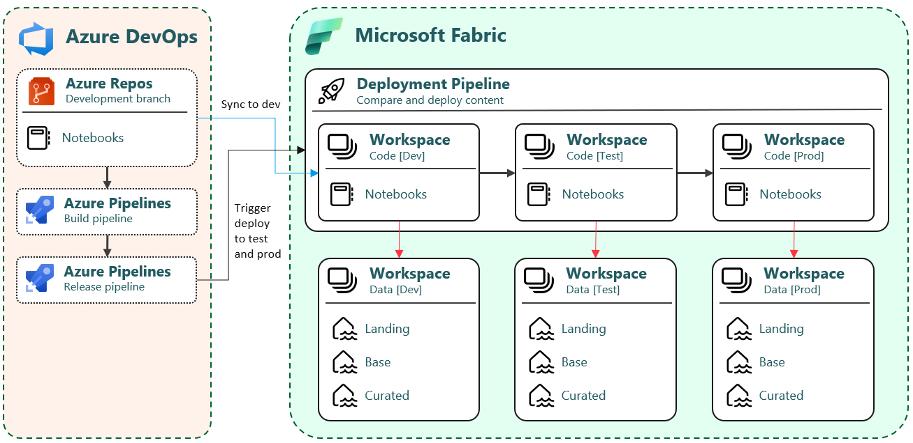

# Prepare deployment (CI/CD)

This section describes how to deploy code (notebooks) from the development branch to Dev, Test and Prod workspaces.

Fabric is still very much "ClickOps" and the CI/CD possiblities is unmature. The following describes the current best practice process. This will be changed, when Fabric API's is no longer in preview and we have support for calling the API's with Service Principal authentication.

## Fabric

### Sync to dev

**Step 1**
 - [Connect dev code workspace to the development branch](https://learn.microsoft.com/en-us/fabric/cicd/git-integration/git-get-started). Set git folder to /Fabric
 - Wait a couple of minutes and verify that notebooks has been synced to workspace
 
The [Update From Git API](https://learn.microsoft.com/en-us/rest/api/fabric/core/git/update-from-git) can unfortunatly not be triggered from Azure DevOps with the use of a Service Principal. This is therefor a manuel process.

### Deployment pipelines

Notebooks are deployed to Test and Production workspaces with the use of a [Fabric Deployment pipeline](https://learn.microsoft.com/en-us/fabric/cicd/deployment-pipelines/get-started-with-deployment-pipelines). 

**Step 2:**
- [Create a new deployment pipeline](https://learn.microsoft.com/en-us/fabric/cicd/deployment-pipelines/get-started-with-deployment-pipelines)

**Step 3:**
- [Assign the three code workspaces to the pipeline](https://learn.microsoft.com/en-us/fabric/cicd/deployment-pipelines/assign-pipeline)

**Step 4:**
- Deploy notebooks to Test and Production stages
- [Configure deployment rules](https://learn.microsoft.com/en-us/fabric/data-engineering/notebook-source-control-deployment) in the Test and Production stage to set the default lakehouse

It's currently a manual process to press the button and [deploy the changes](https://learn.microsoft.com/en-us/fabric/cicd/deployment-pipelines/deploy-content) to the "Code [test]" and "Code [prod]" workspaces.

## Azure DevOps

Note: It's a future feature to use pipelines in Azure DevOps.

### Build pipeline

Changes to content in the remote repository triggers an Azure DevOps Pipeline to test, validate and prepare content for publishing.
The process up to this point is typically referred to as continuous integration (CI).

### Release pipeline

Content is deployed to test and production by using release pipelines. The release pipelines use the [Power BI REST APIs to programmatically execute the Deployment Pipeline in Fabric](https://learn.microsoft.com/en-us/fabric/cicd/deployment-pipelines/pipeline-automation).
Deployment by using release pipelines is typically referred to as continuous deployment (CD).

## Future CI/CD process

This is the desired future process, where the **Build Pipeline** will do the unit testing, configuration changes and deploy the code to the Test workspace. The **Release Pipeline** will make configuration changes and deploy the code to the Production workspace.

