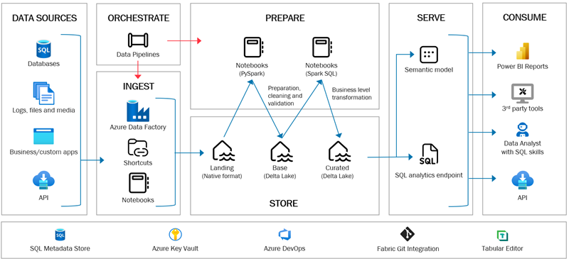

# Architecture & Design

Welcome to twoday best practice module for Lakehouse based data platform solutions using the [Spark engine](https://spark.apache.org/) in Microsoft Fabric. Also known as AquaVilla.

This module is part of a larger set of modules that together constitute twoday Data Platform Best Practice Framework (BPF).

This module has a sister module, the best practice module for Lakehouse based data platform solutions using Azure Databricks (Lighthouse). The Databricks module and the Fabric module share naming standards, architectural principles, code, etc. They separate in areas where Databricks and Fabric are different with respect to features that the two modules have an advantage of utilizing. Example: Databricks has a concept of “Delta Live Tables”, that Fabric doesn’t. Hence the two best practice modules differ because the Databricks based module utilizes “Delta Live Tables”, whereas the Fabric based module doesn’t.

## Purpose

The purpose of this module is to

- Accelerate development of Lakehouse data platforms
- Ensure quality and robustness
- Ease maintenance and operations

## Design principles

twoday Fabric Lakehouse Best Practice module (AquaVilla) is built on:

- Metadata driven approach : A separate Azure SQL Database contains meta data used to control e.g. ingestion of data, processing of Fabric notebooks, etc.
- Naming standards : The names of Fabric items such as Lakehouse items are standardized across this framework and the Databricks based framework - more naming standards are applied "inside" the framework.
- Architectural choices based on years of experience with data platform solution development
- Deep expert insight into the underlying technology stack, in this case Microsoft Fabric.
- To use Fabric items when ever possible. Only use other Azure services if a Fabric version isn't available or is not mature enough.

## Architectural Overview

It's a starting-point architecture.

The illustration above shows several of the design-decisions of the best practice framework with Fabric. Each of the "boxes" is described more indebt in the following sections:

- [Ingest](architecture-design/00-Ingest.md)
- [Store](architecture-design/01-Store.md)
- [Prepare](architecture-design/02-Prepare.md)
- [Serve](architecture-design/03-Serve.md)
- [Orchestrate](architecture-design/04-Orchestrate.md)
- [Monitoring](architecture-design/05-Monitoring.md)

## Additional components

- Azure Data Factory is used for [ingest](00-Ingest.md) as Fabric still lacks important Data Pipeline features.
- A separate small-size Azure SQL Database stores metadata which is being used in several areas of the framework.
- Secrets are managed in Azure Key Vault and used by the metadata-driven data processing notebooks.
- Azure DevOps is used to store all code, etc. under source control and for development collaboration and for solution deployment to test and production.
- During development Fabric Git Integration to Azure DevOps is applied for source code control.
- Semantic models are developed and maintained with Tabular Editor for efficiency.
