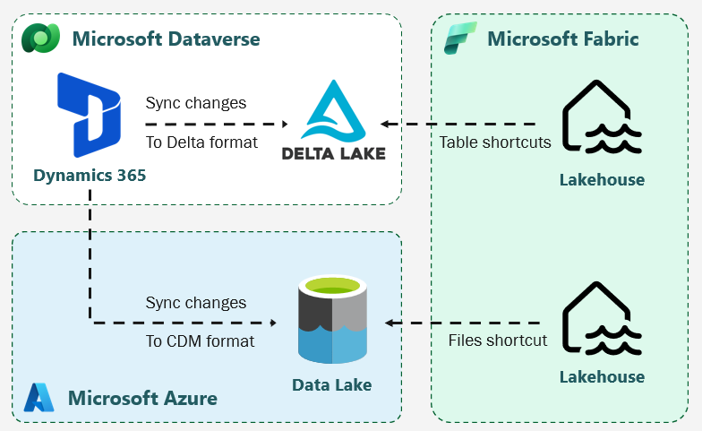
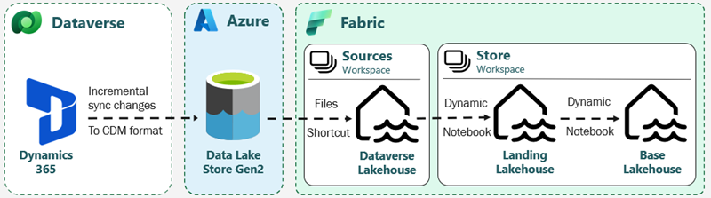

# Data Ingestion

The default and mature option for data ingestion remains Azure Data Factory. It offers a quick and efficient way to get started with the twoday next-generation best practice module for data ingestion.

## Azure Data Factory

For data ingestion, it is recommended to use pipelines that ingest directly into the Landing lakehouse in Fabric OneLake. The following folder structure is used:

`/<source>/<object>/<type>/load_type=<load_type>/year=<year>/month=<month>/day=<day>/run_id=<run_id>/<data>`

### Key Definitions:

- **type**: Specifies whether the data is `data`, `meta`, or `keys`.
- **load_type**: Distinguishes between full and incremental loads (`full` or `delta`).
- **run_id**: A unique folder for each run, allowing multiple full loads on the same day. The format should be based on the time of the day, e.g., `013012345`.
- **data**: Includes one or more files. To optimize Spark performance, using multiple files (but not too many) is recommended rather than enforcing a single-file policy.

## Fabric Data Pipelines

Moving data ingestion pipelines into the Fabric platform becomes an obvious choice as it matures and gains support for critical features:

- [Data Pipeline support for Fabric Workspace variables](https://learn.microsoft.com/en-us/fabric/release-plan/data-factory#data-pipeline-support-fabric-workspace-variables)
- [Data Pipelines Public APIs SPN support](https://learn.microsoft.com/en-us/fabric/release-plan/data-factory#data-pipelines-public-apis-spn-support)
- [Data source identity management (Azure Key Vault)](https://learn.microsoft.com/en-us/fabric/release-plan/data-factory#data-source-identity-management-(azure-key-vault))
- [Data Pipeline Copy Activity support for additional sources](https://learn.microsoft.com/en-us/fabric/release-plan/data-factory#data-pipeline-copy-activity-support-additional-sources)
- [User-assigned Managed Identities support in Connections](https://learn.microsoft.com/en-us/fabric/release-plan/data-factory#user-assigned-managed-identities-support-connections)

Work planning has started, as many of these features are expected to be released in Q1 2025.

## Shortcuts from Sources like ADLS

The twoday next-generation best practice module also supports Azure Data Lake Storage Gen2 (ADLS) as the destination. However, ensure that the destination folder structure aligns with the format outlined above, as this serves as the "API" for the Landing-to-Base Notebook. Create shortcut(s) directly in the Landing lakehouse for seamless data integration.

### Handling Non-Compliant Folder Structures

If the data does not follow the "correct folder structure," it is **NOT** recommended to create a shortcut in the Landing lakehouse. Instead, treat such data as a source and implement an automated process to convert it into the proper structure.

The recommended approach involves using either Notebooks or Fabric Data Pipelines. Maintain a lakehouse as an abstraction layer for the data, and shortcut external sources (whether provided by us or other vendors) into this "source" lakehouse.

### Shortcut Credentials

The recommended authentication method is using [Fabric Workspace Identity](https://learn.microsoft.com/en-gb/fabric/security/security-trusted-workspace-access), which offers the highest security and allows restricted network access to ADLS.

If Fabric Workspace Identity is not an option, consider using a [Service Principal](https://learn.microsoft.com/en-us/fabric/onelake/create-adls-shortcut).

Avoid using account keys, organizational accounts, or shared access signatures (SAS) for security reasons. These methods lack the security rigor needed for enterprise environments. For example:

- **Account keys**: Provide full control over the storage account, exposing a risk if compromised.
- **Organizational accounts**: Rely on user credentials, which may expire or be disabled, leading to operational issues.
- **SAS tokens**: Offer temporary access but can be inadvertently shared or leaked, leading to unauthorized data exposure.

## Dataverse

Ingestion of data from [Dataverse](https://learn.microsoft.com/en-us/power-apps/maker/data-platform/data-platform-intro) is supported through two dedicated "Link" methods that are configured in Dataverse. This enables seamless integration of data from Power Apps and Dynamics 365 into Microsoft Fabric.

Both options use a push approach and incremental writes for table data. Both standard and custom tables can be exported.

### Link to Microsoft Fabric

[Fabric Link](https://learn.microsoft.com/en-us/power-apps/maker/data-platform/azure-synapse-link-view-in-fabric) is an easy setup but can be expensive. It is recommended for small data volumes, such as those from Power Apps.

Microsoft Dataverse direct link to Microsoft Fabric enables organizations to extend their Power Apps and Dynamics 365 enterprise applications and business processes into Fabric. The Link to Microsoft Fabric feature built into Power Apps makes all your Dynamics 365 and Power Apps data available in Microsoft OneLake, the built-in data lake for Microsoft Fabric.

- Creates a "read-replica" of the data in Dataverse Storage in Delta Lake format.
- Latency cannot be controlled. Microsoft promises between 30 and 60 minutes but is working to lower it.
- This method does not preserve history.
- The Delta tables should be copied to the Landing lakehouse to build up history. A notebook can be used for this process.

#### How to Set Up Fabric Link

Follow [this documentation](https://learn.microsoft.com/en-us/power-apps/maker/data-platform/azure-synapse-link-view-in-fabric) to configure Fabric Link to connect Microsoft Dataverse data to Fabric.

From the Tables area in [Power Apps makers](https://make.powerapps.com), link to Fabric by selecting **Analyze > Link to Microsoft Fabric** on the command bar.

All Dataverse tables where the "Change tracking" property is enabled can be linked to Fabric. Automatically creates a Lakehouse in a Fabric Workspace with shortcuts to the Delta Tables. You can use this or manually create your own "table" shortcuts in another lakehouse and then delete the auto-created Lakehouse. You must have the system administrator security role in the Dataverse environment.

### Link to Azure Synapse

[Azure Synapse Link](https://learn.microsoft.com/en-us/power-apps/maker/data-platform/export-to-data-lake) is less expensive and is recommended for large data volumes, such as those from Dynamics 365 FO.

The Azure Synapse Link for Dataverse is a service designed for enterprise big data analytics by delivering scalable high availability with disaster recovery capabilities. With the Azure Data Lake as the storage solution you get a setup that allows you to process data on demand, scale instantly, and only pay per job. It provides enterprise-grade security, auditing, and support.

- Creates a "read-replica" in Azure Data Lake Storage (ADLS).
- Offers configurable incremental latency as low as 10 minutes.
- Preserves full history of the data in ADLS.
- Stores the data in a [CDM folder structure](https://learn.microsoft.com/en-us/common-data-model/model-json) (with model.json and CSV files).
- Uses a non-compliant folder structure.

#### How to Set Up Azure Synapse Link

Follow [this documentation](https://learn.microsoft.com/en-us/power-apps/maker/data-platform/azure-synapse-link-data-lake) to configure Azure Synapse Link to connect Microsoft Dataverse data to ADLS. Ensure you **do not** link to a Synapse workspace, as this will provision and use a Synapse Apache Spark Pool, leading to higher costs. Instead, use the Spark Engine inside Fabric with the Dataverse-to-Landing and the Landing-to-Base Notebooks.

When adding tables, be sure to [configure advanced settings](https://learn.microsoft.com/en-us/power-apps/maker/data-platform/azure-synapse-link-advanced-configuration) and mark all tables as "append only" and enable the "Incremental Update Folder Structure" to get the data incrementally. The user-specified data partition feature enables choosing a custom data partitioning strategy specifically for Dataverse tables. Finance and operations table data are partitioned by the system based on the appropriate partition strategy.

#### Setting Up the Dataverse-to-Landing Notebook

We have created a notebook for ingesting data from Dataverse CDM format on ADLS into the Landing layer. From the Landing layer, the usual Landing-to-Base process takes over.

All steps, from ingestion to storage in the Base layer, are incremental. Additionally, the notebook is written entirely in Python, which incurs lower costs compared to using Spark.

The notebook can be found in the AquaVilla git repository: `solution/Ingest`.

The notebook relies on the meta-database for storing entity watermarks in a stats table. Each table has its own watermark, and an exported entity can be enabled or disabled. Additionally, the notebook auto-generates metadata for the Landing-to-Base process in the `meta.ObjectDefinitionsBase` metadata table.

**Steps to Set Up:**

1. Create a shortcut to the ADLS where the Dataverse is exported, as described in the Handling Non-Compliant Folder Structures section.
2. Set up the notebook. Only one cell requires modification:

- **CDM_FOLDER**: The path to the shortcut, pointing to the ADLS with the CDM export files. Currently, a default lakehouse is expected.
- **DESTINATION_LAKEHOUSE_WORKSPACE_ID**: Destination workspace ID.
- **DESTINATION_LAKEHOUSE**: Destination lakehouse, typically "Landing."
- **DESTINATION_LAKEHOUSE_LOCATION**: Folder name in the files part at the destination lakehouse. When the notebook generates Landing-to-Base metadata, this is prepended to the destination table names.
- **SQL_CDM_STATS_TABLE_SCHEMA**: Schema for the stats table.
- **SQL_CDM_STATS_TABLE_NAME**: The stats table is created automatically if it does not exist. It keeps track of the incremental load and the entities to move to Landing.
- **SQL_LANDING_TO_BASE_OBJECT_DEF_TABLE_SCHEMA**: Schema of the ObjectDefinitions table for creating Landing-to-Base metadata.
- **SQL_LANDING_TO_BASE_OBJECT_DEF_TABLE_NAME**: The ObjectDefinitions table for Landing-to-Base. Metadata is automatically created here.

**Notebook Workflow:**

1. **Discovery**: Searches for new entities from Dataverse. Newly discovered entities are registered in the table defined by `SQL_CDM_STATS_TABLE_NAME`. By default, a new entity is not enabled for ingestion. When running for the first time, enable the entities in the stats table and run the notebook continuously afterward.

2. **Schema Sync**: When a new entity is discovered and enabled, the next run configures Landing by creating folders, schemas, and metadata in the ObjectDefinitions table. To recreate, delete the folders in Landing and their entries in ObjectDefinitions.

3. **Files Sync**: Files are copied using `NoteBookUtils`, which is more efficient than Spark. This efficiency arises because `NoteBookUtils` performs direct file system operations, avoiding the overhead of Spark's distributed computing model, which is unnecessary for simple file transfers. This targeted approach makes `NoteBookUtils` faster and more resource-efficient for such tasks. The files to be copied are defined by the stats table. Resetting an entity's `LastScan` to `NULL` triggers a reload during the next run.
