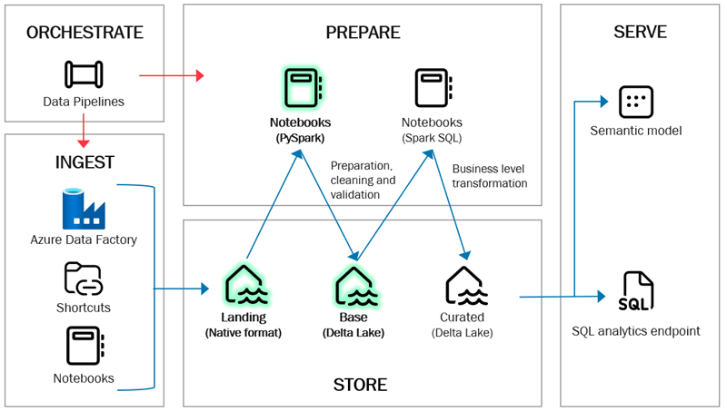
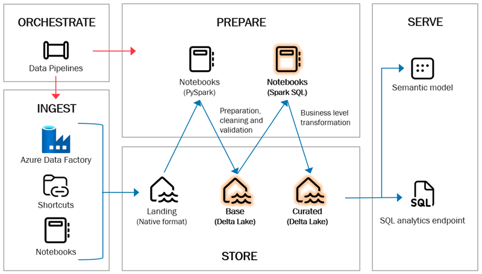

# Data Preparation

Data preparation in the framework ensures that data transitions smoothly between layers, transforming from raw, unstructured formats into trusted, business-ready datasets. This process follows structured patterns and leverages metadata-driven processes for consistency and scalability.

Data is transformed by notebooks, which in some cases call other notebooks and libraries containing twoday framework functionality.

## Landing to Base

The primary purpose of transitioning data from the **Landing** layer to the **Base** layer is to cleanse, deduplicate, and prepare the data for further transformation. In this stage, functional history, such as Slowly Changing Dimensions (SCD2), can also be applied.

The **Base** layer serves as the source for the curated layer, exposing modeled and aggregated data for business use.

### Notebooks

Data movement between these layers is handled by the **LandingToBase notebook**, which reads metadata from a table and processes the specified source path (folder). This notebook is attached to the Landing lakehouse.

### Metadata

The process is defined by metadata stored in the `meta.ObjectDefinitionsBase` table. This metadata specifies how data is read from the Landing layer and written to the Base layer. The following metadata columns are used:

| **Metadata Column**           | **Description**                                                                              |
|-------------------------------|----------------------------------------------------------------------------------------------|
| **ID**                        | Auto-incremental ID, populated automatically.                                                |
| **SourcePath**                | Folder or file path to read from in the Landing layer.                                       |
| **SourceType**                | File type, e.g., Parquet for relational databases or CSV for uploaded files.                 |
| **SourceReadBehavior**        | Read pattern (`Full` or `Auto`). Auto loads the latest full extract and subsequent deltas.   |
| **ReadOptions**               | Spark read options as JSON, e.g., header, separator, multiline.                              |
| **DestinationTable**          | Name of the Delta table in the Base layer.                                                   |
| **DestinationWriteBehavior**  | Write pattern (`overwrite`, `append`, `scd1`, or `scd2`).                                    |
| **Keys**                      | Business keys for upserts in SCD1 and SCD2 operations.                                       |
| **ProjectedColumns**          | Columns to move from Landing to Base. All columns are moved if unspecified.                  |
| **ModifyDateColumn**          | Column used for sorting incremental loads, e.g., a modified date column.                     |
| **Translations**              | JSON object specifying column renaming.                                                      |
| **PartitionBy**               | Columns used for partitioning Delta Tables, e.g., year, month, day.                          |
| **RecreateFlag**              | Indicates whether to drop and recreate the table (`true/false`).                             |
| **IncludeFlag**               | Indicates whether the table should be processed (`true/false`).                              |

### Schema Management

The schema of tables in the Base layer is not maintained in source control. Instead, schemas are automatically created during data movement from the Landing layer. Schema drift is managed by automatically updating the schema as new data arrives.

### Naming Conventions

The framework enforces consistent naming conventions for tables and columns:

#### Table Names

- Structure: `<sourcesystemname>_<entityname>`
- Examples:
  - `adventureworks_lt_address`
  - `dynamics_crm_product_class`
  - `salesforce_sales_customer_group`

#### Column Names

- Structure: `<category>_<qualifiers>_<class>`
- Examples:
  - `address_line_1`
  - `sales_net_amount_dkk`
  - `customer_group_key`

Reserved keywords include:

- `_id`: Primary key indicator; rename source columns to `_code` if not a primary key.
- `_key`: Business key indicator; rename source columns to `_code` if not a business key.
- `_utc` and `_cet`: Timezone indicators.
- `lh_`: Lakehouse system columns.

## Base to Curated

The **Curated** layer transforms data into a dimensional model, consisting of dimensions, facts, and bridge tables. This layer is designed for business consumption.

### Notebooks

Each entity in the Curated layer is processed using a dedicated Spark notebook. Notebooks follow a consistent naming and structure, such as:

- `load_dim_<name>` for dimensions.
- `load_fact_<name>` for facts.
- `load_bridge_<name>` for bridges.

#### Notebook Workflow

1. Define parameters and settings, including load patterns (e.g., SCD1, SCD2).
2. Apply business logic using SparkSQL.
3. Execute the load function (e.g., `load_dimension`, `load_fact`).

### Schema Management

Schemas in the Curated layer are also auto-generated and adapt to schema drift as new data arrives from the Base layer.

### Naming Conventions

#### Auto-Mapping of Facts and Dimensions

The framework includes an auto-mapping feature for facts, replacing business keys with surrogate keys based on naming conventions:

- Business keys use the `_key` suffix.
- Surrogate keys use the `_id` suffix.

Example:

- Fact tables with capture date and shipping date might use `calendar_key` and `calendar_shipping_key`.
- The auto-mapper ensures correct keys are used during transformations.

#### Table Names

- Prefix with purpose: `dim`, `fact`, or `bridge`.

#### Column Names

- Consistent with Base layer conventions (e.g., snake_case).
- Examples:
  - Business key: `dimensionname_key`
  - Business key with role: `dimensionname_rolename_key`
  - Surrogate key: `dimensionname_id`
