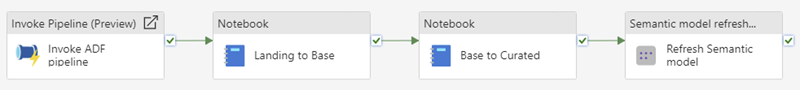

# Orchestration

Efficient orchestration is essential for managing complex data workflows. By coordinating data ingestion, preparation, and serving processes, orchestration ensures seamless execution and reliable data delivery across layers. This section outlines the use of Controller Pipelines and Parent Notebooks as key components in building a robust orchestration framework.

## Controller Pipelines

A common orchestration pattern is to use Data Pipelines for managing high-level dependencies between the ingestion pipelines in Azure Data Factory, the preparation notebooks in Fabric, and the refresh of Semantic Models.

AquaVilla includes two sample pipelines in the "Orchestrate" folder. Below is an example of a simple child pipeline:



### Recommendations

- Execute this pipeline from a "parent" pipeline to set up generic notifications in case the child pipeline fails.
- Notifications can be sent via email and/or Teams.
- Store the pipelines in a dedicated "Orchestrate" workspace for better organization.
- Deployment between environments is currently a manual process. However, updates are rarely required after initial setup.

## Parent Notebooks

Parent notebooks can orchestrate other notebooks in parallel using the `mssparkutils.notebook.runMultiple()` method. AquaVilla provides templates for both **LandingToBase** and **BaseToCurated** processes that support this parallelism pattern with metadata-driven configurations.

### Example: Executing All Dimension Notebooks

```python
DAG = {
    "activities": [
        {
            "name": f"Run_{notebook}",
            "path": notebook,
            "timeoutPerCellInSeconds": cell_timeout_minutes * 60,
            "retry": cell_retry_count,
            "args": {
                # "optional_argument": "optional_value"
            }
        } for notebook in dimension_notebooks
    ],
    "timeoutInSeconds": dag_timeout_hours * 60 * 60,
    "concurrency": dag_concurrency_count
}

output = mssparkutils.notebook.runMultiple(DAG)
```

### Features

These parent notebooks include adjustable parameters for retries, concurrency, and timeout settings. These parameters can be configured when executing the notebooks through the Controller Pipeline.

- **Retries**: Define the number of retry attempts in case of failure.
- **Concurrency**: Control the number of parallel notebook executions.
- **Timeout**: Set time limits for both individual notebook cells and the overall workflow.

By combining Controller Pipelines and Parent Notebooks, the framework ensures a robust and scalable orchestration process for managing complex data workflows.
