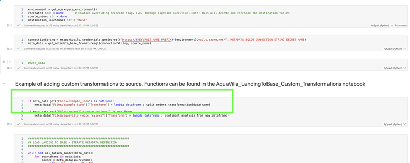

# Custom Landing to Base Transformations

AquaVilla supports custom transformations when moving data from the **Landing** layer to the **Base** layer. While AquaVilla provides built-in support for structured data, some cases—such as handling semi-structured data (e.g., JSON, XML) or unstructured data (e.g., audio, images)—require custom logic.

## Custom Transformation Functions

A custom transformation function is implemented in Python and must be registered in AquaVilla’s internal metadata (distinct from the SQL metadata table). The function should be placed in the **`AquaVilla_LandingToBase_Custom_Transformations`** notebook.

### Function Definition

A transformation function follows a specific format:

- It takes a **DataFrame** as input.
- It returns a **list of tuples**, where each tuple contains:
  1. A **destination table name**
  2. A **DataFrame**
  3. A **list of primary keys** for that table

#### Example: JSON Exploding Transformation

The following function splits an input DataFrame into multiple normalized tables by extracting customer, address, order, and item details from a nested JSON structure.

```python
from pyspark.sql import DataFrame
from pyspark.sql.functions import col, explode

def split_orders_transformation(df: DataFrame) -> list[tuple[str, DataFrame, list[str]]]:
    customers_mapping = {
        "customer.id": "customer_id",
        "customer.name": "name",
        "customer.email": "email",
        "customer.phone": "phone",
    }

    address_mapping = {
        "customer.id": "customer_id",
        "customer.address.street": "street",
        "customer.address.city": "city",
        "customer.address.state": "state",
        "customer.address.zip": "zip",
        "customer.address.country": "country",
    }

    orders_mappings = {
        "order.orderId": "order_id",
        "order.date": "date",
        "order.total": "total",
    }

    order_items_mappings = {
        "item.itemId": "item_id",
        "item.name": "item_name",
        "item.price": "price",
        "item.quantity": "quantity",
    }

    customer_keys = ["customer_id"]
    address_keys = ["customer_id"]
    orders_keys = ["order_id"]
    item_keys = ["item_id"]

    customer_df = df.select([col(c).alias(a) for c, a in customers_mapping.items()])
    address_df = df.select([col(c).alias(a) for c, a in address_mapping.items()])

    orders_df = df.select(
        col("customer.id").alias("customer_id"),
        explode(col("customer.orders")).alias("order"),
    ).select(
        [col("customer_id")] + [col(c).alias(a) for c, a in orders_mappings.items()]
    )

    items_df = df.select(
        col("customer.id").alias("customer_id"),
        explode(col("customer.orders")).alias("order"),
    ).select(
        col("customer_id"),
        col("order.orderId").alias("order_id"),
        explode(col("order.items")).alias("item"),
    ).select(
        [col("customer_id"), col("order_id")] + [col(c).alias(a) for c, a in order_items_mappings.items()]
    )

    return [
        ("customer", customer_df, customer_keys),
        ("customer_address", address_df, address_keys),
        ("customer_orders", orders_df, orders_keys),
        ("customer_orders_items", items_df, item_keys),
    ]
```

## Hooking a Custom Transformation to a Source

To apply a custom transformation, it must be **hooked** to a specific source after metadata has been read. This is typically done in the **Landing to Base notebook**.

### Example: Hooking a Custom Transformation

Below is an example of how to register the `split_orders_transformation` function for a JSON source (`example_json`).



```python
if meta_data.get('Files/example_json') is not None:
    meta_data['Files/example_json']['Transform'] = lambda dataframe: split_orders_transformation(dataframe)
```

With this setup, every time `example_json` is processed, the **split_orders_transformation** function will be executed, transforming the data before it is stored in the Base layer.
