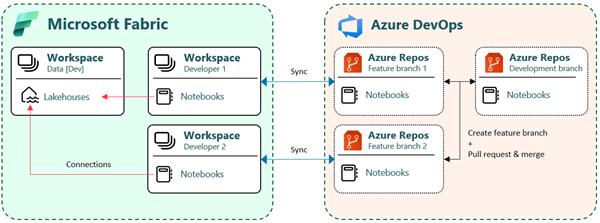

# Feature Development

This guide outlines the steps to start feature development in Microsoft Fabric, ensuring an efficient and structured approach to managing multiple developers working on feature branches simultaneously.

## Developer Workspaces

To maintain isolation and prevent conflicts, developers should work in **private workspaces** when developing features. These workspaces allow independent testing and validation before merging changes.

Feature development follows a structured process:

1. Creating a new feature branch
2. Creating feature workspaces
   - Assigning feature workspaces to Fabric Capacity
   - Assigning workspace permissions
   - (Optional) Creating Managed Private Endpoints
3. Setting up workspace Git integration
4. Committing (syncing) changes to Git
5. Finalizing Development and Creating a Pull Request

## 1. Creating a New Feature Branch

Creating a feature branch in Azure DevOps is a straightforward process. Follow these steps based on your workflow.

### Creating a Branch from the Branches Page

1. **Navigate to the Branches Page**
   - Open your Azure DevOps project.
   - Go to **Repos** in the left-hand menu.
   - Select **Branches**.

2. **Create a New Branch**
   - Click **New Branch**.
   - Provide the following details:
     - **Branch Name**: Follow the naming convention (e.g., `feature/[initials]/[feature-name]`).
     - **Base Branch**: Typically `main` or `development`.

3. **Create the Branch**
   - Click **Create** to finalize.

### Creating a Branch from a User Story or Task

1. **Open the User Story or Task**
   - Navigate to the **Sprint Board**.
   - Select the relevant item.

2. **Use the Context Menu**
   - Click the **ellipsis (⋮)** in the task/story panel.
   - Select **New Branch**.

3. **Confirm Details**
   - Modify the prefilled branch name if needed.
   - Set **Base Branch** to `main` or `development`.

4. **Create the Branch**
   - Click **Create Branch**.

### Best Practices

- Follow the naming convention: `feature/[initials]/[feature-name]` (e.g., `feature/abc/NewDimension`).
- Link branches to relevant work items for better traceability.

## 2. Creating Feature Workspaces

The Azure DevOps pipeline **"Fabric - Feature Creation"** automatically runs when a branch name includes "feature". This pipeline:

- Creates feature workspaces for Ingest and Prepare.
- Assigns workspaces to Fabric Capacity.
- Grants the feature branch creator **Admin** permissions.
- (Optional) Creates and auto-approves Managed Private Endpoints.

The settings for these operations are defined in `fabric_setup.json` located in `/automation/pipelines/resources/`.

## 3. Setting Up Workspace Git Integration

Since Git integration cannot be executed via a Service Principal (SPN), this step must be done manually.

### Steps to Set Up Git Integration

1. Open the **feature workspace**.
2. Go to **Workspace Settings** → **Git Integration**.
3. Enter the following details:
   - **Provider**: Azure DevOps
   - **Organization**: Select your Azure DevOps organization
   - **Project**: Select your project
   - **Repository**: Select the Git repository
   - **Branch**: Choose the feature branch
   - **Folder Path**:
     - Use `solution/ingest` for the Ingest workspace.
     - Use `solution/prepare` for the Prepare workspace.

For a detailed guide, see [Get started with Git integration](https://learn.microsoft.com/en-us/fabric/cicd/git-integration/git-get-started) on Microsoft Learn.

## 4. Committing (Syncing) Changes to Git

Once successfully connected to a Git folder, each developer will work with their own feature branch in their own private workspace.

### Best Practices for Committing Changes

- Commit (sync) small, frequent code changes to reduce conflicts and simplify merges.
- Ensure commit messages are meaningful and describe the changes made.
- Review changes before committing to maintain code quality.

## 5. Finalizing Development and Creating a Pull Request

Once development is complete, create a Pull Request (PR) in Azure DevOps:

1. **Navigate to the Branch List**
   - Open your Azure DevOps project.
   - Go to **Repos** → **Branches**.

2. **Open the Context Menu**
   - Locate your **feature branch**.
   - Click the **ellipsis (⋮)**.

3. **Select "New Pull Request"**
   - The feature branch will be preselected as the source branch.

4. **Complete the PR Setup**
   - Set the target branch to `main` or `development`.
   - Add a title and description.
   - Assign reviewers and link work items.

5. **Create the Pull Request**
   - Review and click **Create**.

### Post-Merge Cleanup

Once merged:

- **The feature branch is automatically deleted.**
- This triggers the **"Fabric - Feature Cleanup"** pipeline, which removes related feature workspaces from Fabric.

## Further Documentation

For more details on CI/CD best practices and lifecycle management, refer to:

- [Best practices for lifecycle management in Fabric](https://learn.microsoft.com/en-us/fabric/cicd/best-practices-cicd)
- [Power BI usage scenarios: Enterprise content publishing](https://learn.microsoft.com/en-us/power-bi/guidance/powerbi-implementation-planning-usage-scenario-enterprise-content-publishing)
